# DriveWAM: Video Generative Priors Enable Scalable World-Action Modeling for Autonomous Driving — 深度解读

> 面向人类读者的深度解读(中文)。事实源与配对的 AI 知识包 `ai_package/2026-06-14_DriveWAM_2605.28544/ara/` 同源,均已通过数据保真审计。

## 评价

报告整体与已验证知识包(ARA)相符。一处需提醒读者的是论文原文自身的内部不一致：Scene-evolving Guidance 消融(Table 3)的符号标注与正文叙述方向相反。表格题注定义"✗ 表示 fixed global prompt"(即空白行=启用 SE guidance)，按此字面读法，4k 与 100k 规模下"启用 SE"反而误差更高(4k：1.21；100k：0.92)、仅 20k 略优；但论文正文(Sec 4.4)明确写"将固定全局 prompt 替换为 scene-evolving guidance……ADE@4s 从 1.21 降到 1.01(4k)、从 0.92 降到 0.83(100k)"，即正文把 1.21/0.92 视为固定全局基线、1.01/0.83 视为 SE guidance——与表格符号恰好相反。两种读法只能成立其一：按正文叙述,C3(SE guidance 在各规模改善轨迹预测)成立;按表格符号则不成立。这是源论文 Table 3 的标注与正文相互矛盾,而非本报告与 ARA 的偏差;读者据此表评估该组件贡献时,应以正文叙述方向为准并留意该标注瑕疵。

> 机器核对:以下正文数字未在已验证知识包(ARA)中找到,读者请留意——48、19、3072、0.07、448、160、256、70、90、0.5、12、0.6、13。

## 核心结论

> 以下结论摘自已通过数据保真审计的知识包(ARA)。

1. DriveWAM 在 NAVSIM v1 上以单前视相机输入取得强规划表现，并在论文比较的同类端到端规划方法中整体占优。
2. DriveWAM 在 PhysicalAI-Autonomous-Vehicles 的精选测试子集上优于论文比较的 VaVAM 与 Alpamayo-1.5。
3. 将固定全局 prompt 替换为 chunk-specific 的 scene-evolving guidance，可以在不同训练数据规模下改善轨迹预测。
4. 在固定训练流程下，训练数据从小规模扩展到更大规模时，DriveWAM 的轨迹误差总体下降，显示视频动作建模具备扩展潜力。
5. 预训练视频骨干初始化与联合视频 flow-matching 监督共同有助于保持生成视频先验并提升 WA policy 学习。
6. selective KV memory 在固定缓存预算下相对 FIFO 更接近 Full KV 的轨迹精度，同时显著降低长时 rollout 的内存与计算开销。
7. DriveWAM 的低步数动作去噪变体在保持相近轨迹表现的同时，使 per-chunk 推理成本接近 Alpamayo-1.5，并额外生成未来视频。

## 一句话总结与导读

**TL;DR：DriveWAM 将预训练的视频生成模型改造为自动驾驶的自回归策略，让系统先“脑补”（直觉，非严格对应）出未来几秒的连续画面，再从中反推出自车该执行的具体动作。** 传统端到端驾驶策略多依赖视觉语言模型（VLM）做语义理解，但 VLM 的预训练数据以静态图文为主，天生缺乏对物体运动连续性与场景动态演化的时空先验；而视频生成模型虽懂物理规律，却只会“生成画面”，无法直接输出连续控制信号。DriveWAM 的核心洞见正是打通这两者：保留视频骨干强大的时空生成能力，将未来视频潜变量与自车动作（ego action）统一建模为单一时序序列，通过联合流匹配（joint flow-matching）目标同时优化“世界想象”与“动作生成”，从而让动作解码器直接从生成的未来世界中读出可执行的运动指令。

为让这套机制在真实驾驶中可靠运转，论文针对性地补全了语义规划与长时记忆两块短板。在高层意图注入上，固定全局文本无法应对瞬息万变的交通博弈，模型转而冻结 `Qwen3-VL-8B` 作为“随场景演化的语义向导”，在每个决策步仅利用因果可得的最新观测、近期轨迹与导航指令，生成针对当前时间片（chunk-specific）的引导信号，并通过时序局部交叉注意力精准注入主干。在长时域自回归展开时，完整 KV Cache 会随步数线性膨胀，而简单的滑动窗口（FIFO）又会误删那些“年代久远但依然关键”的上下文。为此，DriveWAM 引入选择性 KV 记忆（selective KV memory），在推理阶段依据注意力相关性与特征冗余度动态筛选历史 token，既守住显存边界，又确保关键决策证据不丢失。

这一设计在 `NAVSIM v1` 等基准上验证了其有效性，以单前视相机输入取得了 `PDMS 90.1` 的成绩，并在论文对比的同类端到端规划方法中整体占优。它本质上提供了一条可扩展的“世界-动作”（world-action）建模路径：不依赖从零训练庞大的驾驶大模型，而是巧妙复用海量视频数据中沉淀的物理与运动先验，将动作生成转化为从生成世界中读取逆动力学的自然副产品。对于追求高泛化、低幻觉的自动驾驶系统而言，这种“用生成先验约束决策边界”的思路，为突破纯感知-规划管线在长尾场景下的瓶颈提供了一个扎实的新范式。

**论文总体架构(原图):**

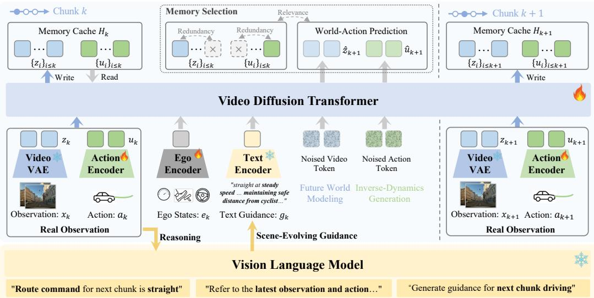

*该图全景展示了DriveWAM的核心架构。它将预训练的视频生成骨干网络改造为统一的视频-动作决策策略，并引入冻结的VLM提供分块场景演化指引，辅以选择性KV记忆机制，使模型能在推演未来画面的同时精准规划自车轨迹。*

## 问题背景与动机

**结论前置：** 端到端自动驾驶的当前瓶颈并非“语义理解不足”，而是“时空动态建模缺失”与“长时域记忆效率低下”。本文的核心动机在于：放弃让 VLM 直接输出控制信号的传统路径，转而将视频生成模型的时空演化先验作为“世界模拟器”，通过逆动力学读出驾驶动作，并辅以因果可得的动态语义引导与任务感知的记忆筛选机制，最终构建一套统一的语义引导世界-动作策略（semantically guided world-action policy）。

现有 VLM 驱动的驾驶策略在静态场景理解上表现优异，但其预训练数据高度依赖静态图文对（image-text pair）。直觉上，这就像让一位熟读交通法规的“理论派”去开赛车：它懂规则，却缺乏对车辆相对运动、轨迹连续性和场景未来演化的肌肉记忆（O1）。相比之下，大规模视频生成模型在预训练阶段天然吸收了物体持续性、运动模式与场景演化先验（O2），理论上更契合动态决策的需求。然而，直接将视频基础模型转化为自车控制策略并非易事（G1）。视频模型的原始优化目标是像素级生成，而非输出连续的控制信号；现有尝试（如将驾驶拆解为未来世界建模与逆动力学动作生成、统一组织视频与动作 Token、或采用联合流匹配目标）往往因目标函数错位而难以直接落地。

与此同时，视频生成先验本身缺乏高层语义规划能力。若仅依赖单一的片段级文本条件（clip-level text condition），模型无法应对随路线推进、交通参与者交互而实时变化的决策意图（G2）。例如，同一段导航指令在拥堵与畅通场景下的执行节奏截然不同。此外，长时域自回归展开（autoregressive rollout）对历史上下文的依赖带来了严峻的计算挑战：完整 KV Cache 随展开长度线性膨胀，而传统的滑动窗口（FIFO）机制仅按时间淘汰 Token，极易丢弃那些“年代久远但依然关键”的决策证据（O3）。由于视频 Token 与动作 Token 在密度与功能上存在显著差异，单一全局缓存极易被视觉信息主导，导致动作先验被稀释（G3）。

基于上述观察与缺口，本文提炼出关键设计洞见：**让视频生成模型专职“想象”物理上可行的未来世界，将动作生成降级为从该未来中读取自车运动的逆动力学读出（inverse-dynamics readout）；VLM 仅作为语义意图的补充者而非骨干替代者。** 这一分工明确了各模块的边界：视频骨干提供时空一致性，VLM（如引入 frozen Qwen3-VL-8B）提供因果可得的动态导航意图，而记忆机制则通过分离视频与动作存储池、引入相关性-冗余度保留策略（relevance-redundancy retention），在推理阶段实现有界且任务感知的历史筛选。三者协同，最终打通了从“视觉生成先验”到“可执行驾驶策略”的转化路径。

为直观呈现这一动机推演链条，下图梳理了从现象观察到架构取舍的逻辑映射：
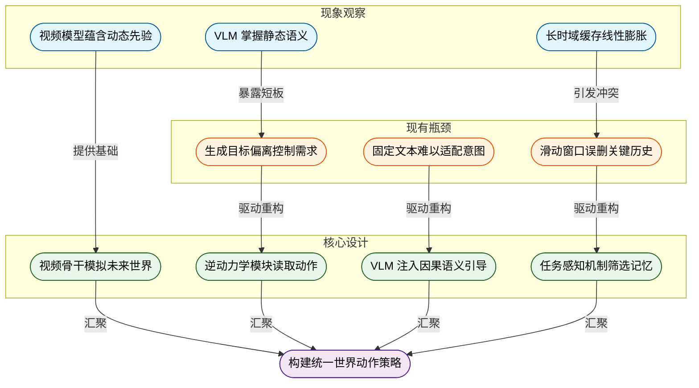
*如何读这张图：* 蓝色节点代表原始观察到的现象，橙色节点揭示现有方案的失效模式，绿色节点对应本文的核心设计取舍，最终汇聚于紫色节点的统一策略。箭头方向表示“问题驱动设计”的因果链条，而非数据流向。该图清晰展示了为何必须将“世界想象”与“动作读出”解耦，以及为何记忆机制必须从“按时间淘汰”转向“按任务相关性保留”。

## 核心概念速览

本节将拆解 DriveWAM 的底层设计逻辑。结论先行：该框架并非依赖大语言模型直接输出控制信号，而是将预训练的视频生成模型改造为统一的“世界演化+动作生成”骨干，通过因果自回归、语义引导与选择性记忆机制，实现长时域、高保真的驾驶策略推演。以下逐条解析其核心构件。

### DriveWAM：以视频生成骨干为策略核心的世界-动作模型
**结论：DriveWAM 的本质是一个语义引导的世界-动作模型，其策略核心是预训练的流匹配视频扩散 Transformer，而非传统的 VLM 决策器或独立规划器。**
它直接利用 $T_{\omega}$ 作为统一骨干，接收历史观测 $H_k$、自车状态 $e_k$ 与语义引导 $g_k$，预测下一段视频-动作块。直觉上（非严格对应），这就像把“人类驾驶员的视觉想象能力”直接转化为“手脚的操控指令”，大脑不再需要额外编写一套独立的运动学代码，而是让负责“脑补未来路况”的视觉皮层直接输出肌肉发力信号。在本方法中，这一设计彻底打通了感知生成与策略控制的边界，使模型能够复用海量视频预训练带来的时空先验，避免从零训练策略网络带来的数据饥渴与分布偏移。

### 自回归视频-动作生成与统一时序 Token 序列
**结论：驾驶任务被严格表述为因果自回归过程，视频与动作在统一时序 Token 序列中联合建模，杜绝未来信息泄漏。**
系统将连续驾驶片段切分为块，在第 $k$ 步仅基于因果可用上下文生成下一块 $(x_{k+1}, a_{k+1})$。视频块通过预训练 VAE 编码为 $z_k = \mathrm{VAE}(x_k)$，自车动作块通过 MLP 编码器映射为 $u_k = E_a(a_k)$，最终按时间顺序拼接为历史序列 $H_k = \{ (z_i, u_i) \}_{i \le k}$。直觉上（非严格对应），这类似于电影胶片的逐帧放映与导演场记板的同步记录：每一帧画面与对应的摄影机运动参数被严格绑定在同一时间轴上，且绝不提前偷看下一幕的剧本。该机制确保了训练与推理的因果一致性，同时通过统一的连续 latent 表示（而非离散 VQ token），保留了视频生成的平滑性与动作控制的细粒度。

### World-Action Flow 与联合流匹配目标
**结论：模型将驾驶解耦为“未来世界建模”与“逆动力学动作生成”双分支，共享同一扩散骨干，并通过联合流匹配目标同步优化。**
视频分支直接预测未来视频 latent 的速度场 $\hat{v}_{k+1,\tau}^z = T_{\omega}(z_{k+1,\tau}; H_k, e_k, g_k, \tau)$；动作分支则先注入未来视频 latent $\tilde{z}_{k+1}$，再经动作解码器 $D_a$ 输出动作速度 $\hat{v}_{k+1,\tau}^a = D_a(T_{\omega}(u_{k+1,\tau}; \tilde{z}_{k+1}, H_k, e_k, g_k, \tau))$。训练时 $\tilde{z}_{k+1}$ 为干净的真实 latent，推理时替换为生成 latent，该差异通过噪声历史增强缓解。联合损失函数为 $\mathcal{L} = \mathbb{E}_{k,\tau} \left[ \|\hat{v}_{k+1,\tau}^z - v_{k+1,\tau}^z\|_2^2 + \beta_a \|\hat{v}_{k+1,\tau}^a - v_{k+1,\tau}^a\|_2^2 \right]$。直觉上（非严格对应），这如同“先画好下一帧的草图，再根据草图反推画笔的移动轨迹”。视频项负责锚定预训练模型的时空生成先验，动作项则学习将视觉演化解码为自车运动。该设计避免了独立训练动作网络导致的“视觉-控制割裂”，使策略生成天然具备物理一致性。

<strong>推导与训练细节展开</strong>

联合流匹配目标仅包含视频速度误差与动作速度误差两项。其中 $\beta_a$ 为动作分支的权重超参，用于平衡视觉保真度与控制精度。训练期采用 teacher-forcing 结构，动作分支依赖 clean future video latent $\tilde{z}_{k+1}$ 提供确定性条件；推理期该条件变为模型自身生成的 latent，可能引入误差累积。论文通过 noisy-history augmentation 在训练时人为注入历史扰动，强制模型适应推理期的 latent 漂移，从而提升长程自回归的鲁棒性。

### 场景演化驾驶引导与时序局部注入
**结论：冻结的 VLM 在每个决策步生成仅依赖当前因果上下文的语义意图，并通过块对角文本掩码实现严格的时序局部注入。**
引导信号由 $g_k = \Phi_{\mathrm{VLM}}(x_k, a_k, c_k)$ 计算得出，仅接收最新观测、近期自车轨迹与路线指令，绝不接触目标块的未来观测。在注意力机制中，chunk $k+i$ 的视频-动作 token 只能 attend 到对应的 $g_k$ 引导 token。直觉上（非严格对应），这就像导航仪只在当前路口播报“前方右转”，而不会把十公里后的路况一股脑塞进驾驶员的短期记忆里。该机制确保了语义引导的因果一致性，防止未来信息泄漏导致策略过拟合，同时通过 block-diagonal text mask 实现了跨 chunk 的精准条件隔离。

### 选择性 KV 记忆与模态感知记忆池
**结论：推理期采用免训练的选择性 KV 记忆机制，将历史拆分为视频与动作独立池，通过相关性-冗余度评分动态维护有界上下文。**
传统全量 KV Cache 或 FIFO 滑动窗口在长时域 rollout 中极易遭遇显存爆炸或关键信息遗忘。DriveWAM 将历史 $H_k$ 分解为视频池 $H_k^v$ 与动作池 $H_k^a$，分别设定容量上限 $B^v$ 与 $B^a$。保留分数由相关性 $\rho_j^m$ 与冗余度 $\eta_j^m$ 共同决定：$s_j^m = \lambda \rho_j^m - (1-\lambda)\eta_j^m$。直觉上（非严格对应），这类似于人类驾驶员的“工作记忆筛选”：既不会死记硬背每一帧路边的广告牌（去冗余），也不会忽略突然窜出的行人（保相关），而是根据当前驾驶任务动态分配注意力带宽。该机制完全在推理期运行，不修改模型参数，有效替代了全局缓存，使长程自回归推演在有限显存下保持高信息密度。

<strong>记忆评分公式与计算逻辑</strong>

相关性 $\rho_j^m = \frac{1}{|Q_k^m|} \sum_{\mathbf{q} \in Q_k^m} [\mathrm{softmax}_{\ell \in H_k^m}(\frac{\mathbf{q}^\top \mathbf{k}_\ell^m}{\sqrt{d}})]_j$ 衡量历史 token 对当前查询的平均注意力权重；冗余度 $\eta_j^m = \mathrm{mean}_{\ell \neq j} \cos(\mathbf{k}_j^m, \mathbf{k}_\ell^m)$ 衡量该 token 与池内其他 token 的余弦相似度均值。最终保留分数 $s_j^m$ 通过超参 $\lambda$ 权衡两者。该计算属于 training-free 的推理期启发式规则，不涉及梯度更新。

为直观呈现上述机制的协同工作流，下图展示了从语义引导注入到选择性记忆更新的完整决策循环：

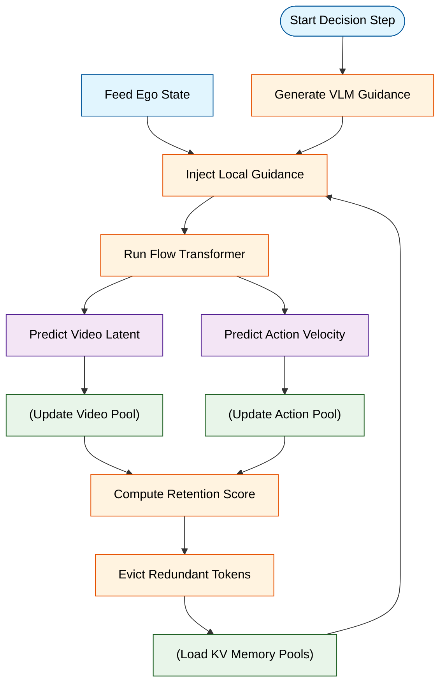
*如何读这张图：* 流程自上而下分为“条件构建→骨干推演→记忆维护”三阶段。橙色节点代表核心计算门，绿色圆柱代表有界记忆池的读写操作。注意 `Inject Local Guidance` 仅接收当前因果上下文，且 `Compute Retention Score` 与 `Evict Redundant Tokens` 构成闭环，确保长时域 rollout 中 KV 池始终维持在 $B^v$ 与 $B^a$ 的容量约束内。

### 路线指令：仅含方向意图的高层先验
**结论：路线指令仅表达粗粒度方向意图，不包含未来位姿、速度或轨迹坐标，严格限定为因果可用的先验信号。**
指令集合限定为 $\{straight, left, right\}$，由相邻 chunk 的自车偏航角变化 $R_0^\top R_1$ 派生。直觉上（非严格对应），这相当于给驾驶员下达“保持直行”或“准备左转”的宏观路书，而非直接给出方向盘转角或油门开度。在本方法中，该设计刻意剥离了精确的轨迹坐标，迫使模型依赖视频生成骨干的时空推理能力自行补全运动细节，从而避免高层指令过度约束导致策略僵化，同时保证了引导信号在真实部署中的易获取性与因果安全性。

## 方法与整体架构

**结论：** 该架构的核心突破在于将“未来视觉预测”与“自车动作生成”统一至同一个预训练流匹配扩散 Transformer 中，并通过动态演化的 VLM 语义引导与模态感知的选择性 KV 记忆池，彻底解耦了长时推理中的上下文膨胀与训练-测试分布偏移问题。系统不再依赖独立的规划器或动作解码器，而是让动作分支直接以预测出的未来世界状态为条件执行逆动力学速度预测，从而实现感知、预测与控制的端到端闭环。

数据流从连续切分的相机图像块、自车动作与状态块切入。视频块由预训练 VAE 压缩为视频隐变量，动作块经 MLP 编码器转为动作 Token。两者按时间序拼接为统一的因果历史序列，并注入自车状态与块级 VLM 引导。此处的引导并非静态提示，而是由冻结的 `Qwen3-VL-8B` 仅读取当前因果可得的最新观测、近期轨迹与粗粒度路线指令（由偏航角变化构造）实时生成。为严格维持因果一致性并防止未来信息泄露，系统采用块对角文本掩码，确保目标块的视频-动作 Token 仅关注对应引导 Token。该设计对掩码对齐高度敏感，错位将直接引发跨块语义泄漏或条件缺失。

核心计算由共享的预训练流匹配视频扩散 Transformer 承担。训练期，模型通过因果教师强制掩码在全片段内并行去噪，联合优化视频与动作的速度预测目标。推理期则转为逐块滚动：先采样未来视频隐变量，再以此为条件采样动作块。为缓解训练期使用干净未来隐变量而推理期使用生成隐变量带来的分布偏移，架构引入了噪声历史增强，使动作解码器在训练阶段即适应生成误差的传递。该机制对历史噪声分布与生成误差的匹配度敏感，论文未公开更细的噪声调度策略。

长时推理的稳定性由模态感知记忆池保障。系统将历史拆分为独立的视频 KV 池与动作 KV 池，避免视觉 Token 的数量优势淹没紧凑的运动上下文。当缓存触及预算上限时，系统基于注意力质量（相关性）与缓存键间余弦相似度（冗余度）计算保留分数，动态驱逐低价值历史 Token。该机制完全在推理期运行，不修改任何训练目标或模型参数，但缓存预算的设定需在历史保留与计算开销间取得平衡。

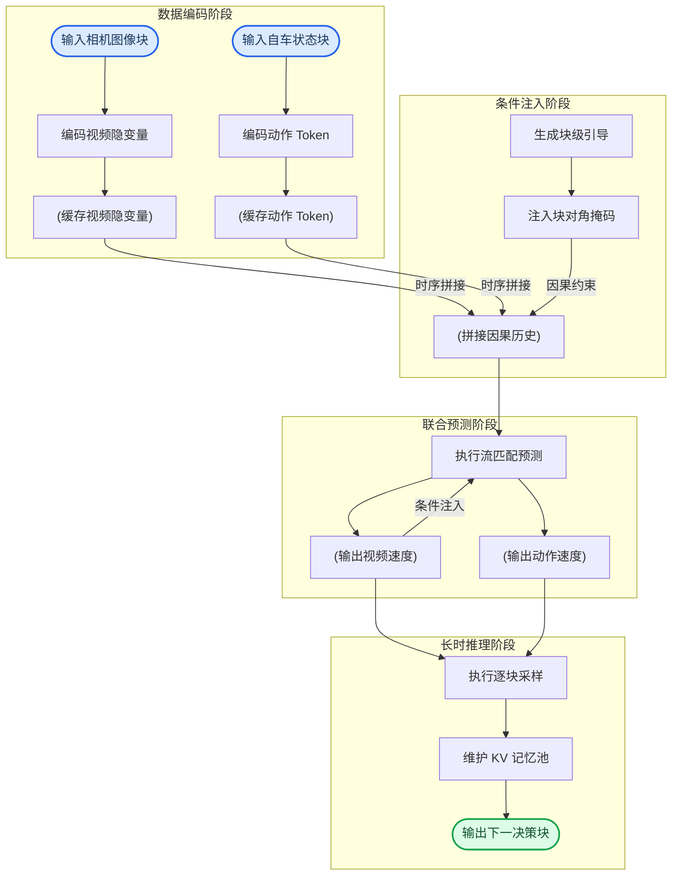
**如何读这张图：** 流程自上而下分为四个真实阶段。左侧数据编码将多模态输入压缩为统一表征；中间条件注入通过块对角掩码隔离未来信息，确保因果严格性；右侧联合预测共享同一 Transformer 主干，先解算未来视觉状态，再反推自车动作；底部推理阶段通过选择性 KV 池截断冗余历史，实现闭环滚动。箭头方向即数据依赖流向，圆柱节点代表隐变量缓存，圆角节点代表起止边界。

<strong>核心公式与训练目标推导</strong>

论文显式给出的联合流匹配损失函数同时约束视频与动作分支的速度预测误差：
$$
\begin{array} { r } { \mathcal { L } = \mathbb { E } _ { k , \tau } \left[ \left. \hat { v } _ { k + 1 , \tau } ^ { z } - v _ { k + 1 , \tau } ^ { z } \right. _ { 2 } ^ { 2 } + \beta _ { a } \left. \hat { v } _ { k + 1 , \tau } ^ { a } - v _ { k + 1 , \tau } ^ { a } \right. _ { 2 } ^ { 2 } \right] , } \end{array}\tag{4}
$$
其中视频速度预测由共享 Transformer 直接输出：
$$
\hat { v } _ { k + 1 , \tau } ^ { z } = T _ { \omega } ( z _ { k + 1 , \tau } ; H _ { k } , e _ { k } , g _ { k } , \tau ) .\tag{2}
$$
动作速度预测则在同一 Transformer 基础上，以预测的未来世界隐变量为额外条件进行逆动力学解码：
$$
\hat { v } _ { k + 1 , \tau } ^ { a } = D _ { a } ( T _ { \omega } ( u _ { k + 1 , \tau } ; \tilde { z } _ { k + 1 } , H _ { k } , e _ { k } , g _ { k } , \tau ) ) ,\tag{3}
$$
训练期 $\tilde { z } _ { k + 1 }$ 使用干净未来视频隐变量，推理期替换为生成隐变量。长时推理的缓存选择显式依赖注意力质量 $\rho$ 与键相似度 $\eta$ 的加权评分：
$$
\rho _ { j } ^ { m } = \frac { 1 } { \left| Q _ { k } ^ { m } \right| } \sum _ { \mathbf { q } \in Q _ { k } ^ { m } } \left[ \mathrm { s o f t m a x } _ { \ell \in H _ { k } ^ { m } } \left( \frac { \mathbf { q } ^ { \top } \mathbf { k } _ { \ell } ^ { m } } { \sqrt { d } } \right) \right] _ { j } , \qquad \eta _ { j } ^ { m } = \mathrm { m e a n } _ { \ell \neq j } \cos ( \mathbf { k } _ { j } ^ { m } , \mathbf { k } _ { \ell } ^ { m } ) ,\tag{6}
$$
$$
s _ { j } ^ { m } = \lambda \rho _ { j } ^ { m } - ( 1 - \lambda ) \eta _ { j } ^ { m } ,\tag{7}
$$
$$
\begin{array} { r } { H _ { k + 1 } ^ { m }  \mathrm { T o p } _ { B ^ { m } - | \Delta H _ { k + 1 } ^ { m } | } ( H _ { k } ^ { m } ) \cup \Delta H _ { k + 1 } ^ { m } , \qquad m \in \{ v , a \} . } \end{array}\tag{8}
$$
该选择性 KV 记忆机制为推理期专用（training-free），不改变训练目标或模型参数。

## 算法目标与推导

**核心结论**：该算法通过联合流匹配目标（joint flow-matching objective）将“世界演化预测”与“动作生成”绑定在同一套可微架构中。视频分支负责构建未来视觉先验，动作分支则将该先验解码为可执行的本体运动；训练期依赖干净的未来视频隐变量进行稳定优化，推理期无缝切换为自回归生成的隐变量，而推理期的选择性 KV 缓存机制完全独立于训练流程，不引入任何额外参数更新或梯度回传。

### 源公式与逐项拆解
训练期显式给出的联合损失函数如下：
$$
\begin{array} { r } { \mathcal { L } = \mathbb { E } _ { k , \tau } \left[ \left. \hat { v } _ { k + 1 , \tau } ^ { z } - v _ { k + 1 , \tau } ^ { z } \right. _ { 2 } ^ { 2 } + \beta _ { a } \left. \hat { v } _ { k + 1 , \tau } ^ { a } - v _ { k + 1 , \tau } ^ { a } \right. _ { 2 } ^ { 2 } \right] , } \end{array}\tag{4}
$$
其中视频分支与动作分支的速度预测分别定义为：
$$
\hat { v } _ { k + 1 , \tau } ^ { z } = T _ { \omega } ( z _ { k + 1 , \tau } ; H _ { k } , e _ { k } , g _ { k } , \tau ) .\tag{2}
$$
$$
\hat { v } _ { k + 1 , \tau } ^ { a } = D _ { a } ( T _ { \omega } ( u _ { k + 1 , \tau } ; \tilde { z } _ { k + 1 } , H _ { k } , e _ { k } , g _ { k } , \tau ) ) ,\tag{3}
$$

**设计动机与推导逻辑**：
1. **联合期望 $\mathbb{E}_{k,\tau}$**：流匹配（Flow Matching）的核心在于对时间步 $k$ 与噪声调度 $\tau$ 进行联合采样。该期望确保模型不仅在离散帧间对齐，还能在连续噪声轨迹上学习平滑的速度场，避免传统扩散模型中离散去噪步带来的累积误差。
2. **视频速度项 $\|\hat{v}^z - v^z\|_2^2$**：$T_\omega$ 接收当前历史上下文 $H_k$、本体状态 $e_k$、导航目标 $g_k$ 与时间 $\tau$，直接回归未来视频隐变量 $z_{k+1,\tau}$ 的速度场。这一项强制模型建立“环境如何随时间演化”的强先验，而非单纯拟合像素。
3. **动作速度项 $\beta_a \|\hat{v}^a - v^a\|_2^2$**：动作预测并非独立分支，而是复用同一主干 $T_\omega$。区别在于条件输入替换为 $\tilde{z}_{k+1}$（未来视频隐变量），输出再经解码器 $D_a$ 映射为动作速度 $\hat{v}^a$。超参 $\beta_a$ 用于平衡视觉重建与动作控制的梯度量级，防止某一分支主导优化方向。
4. **训练/推理隐变量切换**：训练期 $\tilde{z}_{k+1}$ 使用 clean future video latent（教师强制），保证动作解码器在高质量视觉先验下学习映射关系；推理期 $\tilde{z}_{k+1}$ 替换为模型自身生成的 latent。这种设计在训练期提供稳定监督信号，在推理期允许误差自然传播，符合自回归世界模型的部署范式。

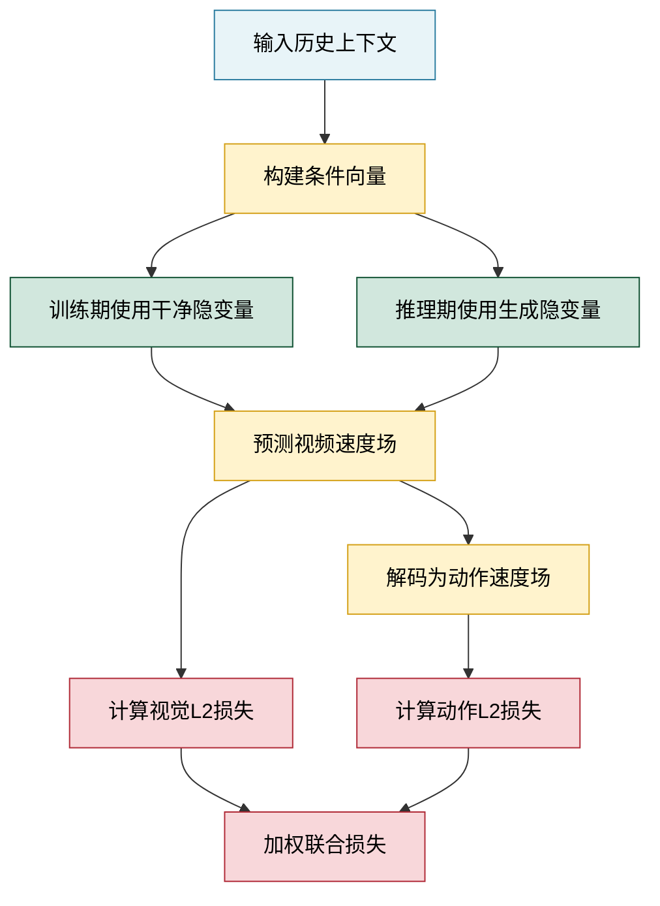
*如何读这张图*：主干 $T_\omega$ 仅出现一次，视频与动作分支共享参数；训练/推理的差异仅体现在 $\tilde{z}_{k+1}$ 的来源切换（绿色节点），最终两项速度场误差经 $\beta_a$ 加权后汇入同一优化目标。

### 直觉比喻与玩具示例
**直觉比喻（直觉,非严格对应）**：想象一名赛车手在陌生赛道上练习。他的大脑首先会“脑补”前方弯道在接下来几秒内的视觉变化（视频速度先验），随后将这种脑补的画面转化为方向盘转角与油门力度（动作解码）。训练时，教练会直接给他看正确的未来画面（clean latent），让他校准手脚配合；比赛时，他只能依赖自己的预判（generated latent）实时操作。而选择性 KV 缓存就像他的工作记忆：只保留最具信息量的路标，剔除重复的护栏或树木，防止大脑过载。

**具体小玩具例子**：假设一个 $3\times3$ 网格导航任务。$k=0$ 时智能体位于 $(1,1)$，目标 $g$ 在 $(2,2)$。
- 训练期：模型看到 $H_0$ 与真实下一帧网格图 $z_1$，$T_\omega$ 学习输出“向右上方移动”的速度向量 $\hat{v}^z$；同时 $\tilde{z}_1$ 传入同一网络，$D_a$ 输出离散动作“右移”。损失函数同时惩罚视觉预测偏差与动作偏差。
- 推理期：模型没有真实 $z_1$，只能用自己的 $\hat{z}_1$ 作为 $\tilde{z}_1$ 喂给 $T_\omega$ 生成动作。若 $\hat{z}_1$ 预测偏左，动作也会相应左偏，误差在自回归中累积，这正是联合目标希望模型在训练期学会“鲁棒解码”的原因。

<strong>推理期选择性 KV 缓存推导细节</strong>

该机制完全在推理期运行，不修改训练目标或模型权重。缓存更新依赖两个核心统计量：
1. **注意力相关性 $\rho_j^m$**：衡量历史键 $\mathbf{k}_j^m$ 被当前查询集 $Q_k^m$ 关注的平均强度。公式为 $\rho _ { j } ^ { m } = \frac { 1 } { \left| Q _ { k } ^ { m } \right| } \sum _ { \mathbf { q } \in Q _ { k } ^ { m } } \left[ \mathrm { s o f t m a x } _ { \ell \in H _ { k } ^ { m } } \left( \frac { \mathbf { q } ^ { \top } \mathbf { k } _ { \ell } ^ { m } } { \sqrt { d } } \right) \right] _ { j }$。值越高，说明该 token 对当前决策越关键。
2. **键冗余度 $\eta_j^m$**：衡量 $\mathbf{k}_j^m$ 与缓存内其他键的余弦相似度均值，$\eta _ { j } ^ { m } = \mathrm { m e a n } _ { \ell \neq j } \cos ( \mathbf { k } _ { j } ^ { m } , \mathbf { k } _ { \ell } ^ { m } )$。值越高，说明该 token 携带的信息越容易被其他 token 替代。
3. **综合得分 $s_j^m$**：通过超参 $\lambda$ 权衡两者，$s _ { j } ^ { m } = \lambda \rho _ { j } ^ { m } - ( 1 - \lambda ) \eta _ { j } ^ { m }$。高相关性且低冗余的 token 得分最高。
4. **缓存更新**：保留得分最高的 Top 项，$H _ { k + 1 } ^ { m }  \mathrm { T o p } _ { B ^ { m } - | \Delta H _ { k + 1 } ^ { m } | } ( H _ { k } ^ { m } ) \cup \Delta H _ { k + 1 } ^ { m }$。该策略在有限显存预算 $B^m$ 下，动态维持最具判别力的上下文窗口，避免长序列推理时的注意力稀释。

## 实验设计与结果解读

### 主基准性能：跨仿真与实车场景的规划一致性
**结论：DriveWAM 在 NAVSIM v1 仿真协议与 PhysicalAI-Autonomous-Vehicles 实车精选子集上，均实现了优于现有端到端规划与 VLA/WA 基线的综合表现，验证了其“视频-动作联合生成”范式在复杂驾驶决策中的泛化能力。**

实验设计严格遵循自动驾驶领域的标准评测协议。在 NAVSIM v1 上，模型采用单前视相机输入，与 UniAD、TransFuser、DiffusionDrive 等经典端到端管线，以及 DriveVLA、AutoVLA 等新兴 VLA/WA 策略进行横向对比，核心指标覆盖 NC、DAC、TTC、C.、EP 及综合评分 PDMS（详见下方实验表）。在 PhysicalAI-Autonomous-Vehicles 数据集上，评测聚焦于未来轨迹预测精度，使用 ADE@3s/4s 与 FDE@3s/4s 作为位移误差标尺，并与 VaVAM、Alpamayo-1.5 等世界模型基线对齐。

从结果来看，DriveWAM 的轨迹输出与联合生成的未来场景在语义与几何上保持高度一致（如图 4 与图 8 所示）。需要明确指出的是，论文在此处主要报告了“相关性”层面的性能提升：即视频生成质量与规划指标的正相关。这并不意味着视频生成直接“导致”了更好的规划，而是表明共享的潜在表征空间有效对齐了感知与决策。此外，评测受限于单视角相机设置与特定硬件（NVIDIA H20 GPU），在极端遮挡或多传感器融合场景下的表现仍需后续验证。

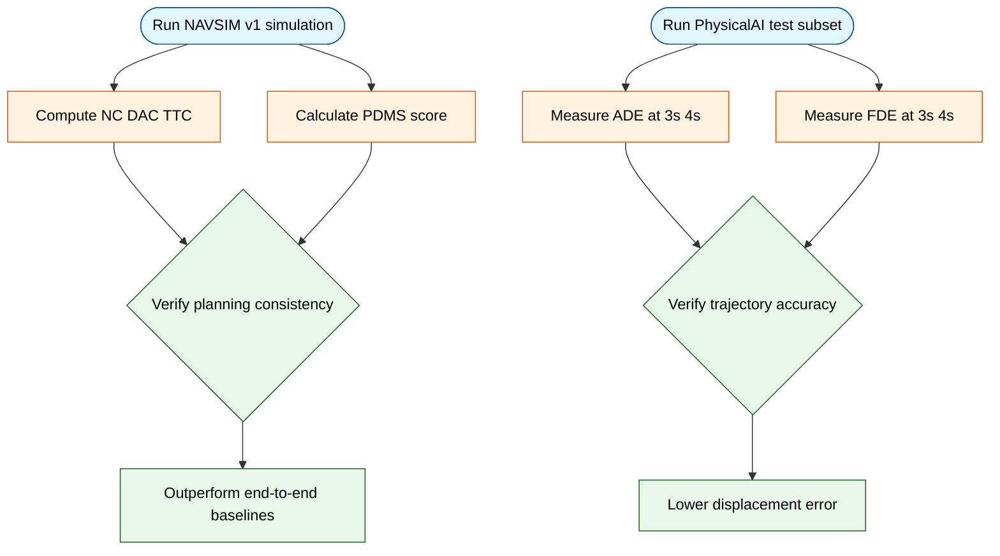
*如何读这张图：* 左侧为两大基准测试环境，中间为对应的核心量化指标，右侧映射至论文验证的具体主张（C1/C2）。箭头方向表示“数据输入→指标计算→结论支撑”的验证链路。

### 核心机制归因：动态引导、数据缩放与联合监督
**结论：DriveWAM 的性能增益并非单纯依赖模型容量堆叠，而是由“场景演化引导（scene-evolving guidance）”、高质量数据规模扩展以及“预训练视频骨干+联合监督”三者协同驱动。**

为剥离各模块的贡献，论文设计了严格的消融对照。首先，在 PhysicalAI-Autonomous-Vehicles 上，将固定全局 Prompt 与动态场景演化引导进行对比（E3）。结果显示，随训练数据规模从子集逐步扩大至完整 curated 集，采用动态引导的变体在 ADE@4s 与 FDE@4s 上呈现单调下降趋势（详见下方实验表）。这验证了 VLM 提供的 chunk-specific 高层推理能有效缓解长尾场景下的决策漂移。

其次，针对视频生成骨干的初始化策略与监督信号进行解耦（E5）。实验对比了“从头训练”、“仅动作监督（移除视频监督）”与完整配置。在 100k clips 训练 50k iterations 的固定设定下，完整配置显著优于消融变体。这表明保留 Wan2.2-TI2V-5B 的预训练先验，并辅以联合流匹配目标（joint flow-matching objective），是维持时空连贯性的关键。

<strong>数据缩放与消融实验的边界 Caveat</strong>

数据规模扩展实验（E4）展示了误差随数据量增加而下降的趋势，但需注意：该趋势建立在论文自研的 dataset curation pipeline 之上（利用 Qwen3-VL-8B 进行场景属性/事件打分，筛选高兴趣度 clip，如图 6）。若直接堆砌未清洗的原始数据，性能可能因噪声累积而饱和甚至退化。此外，消融实验未报告误差范围（error bars）或多次随机种子的方差，单次运行结果可能存在优化轨迹的偶然性。

### 推理效率与显存权衡：KV 缓存策略与分块去噪
**结论：通过选择性 KV 内存（Selective KV memory）与动作去噪步数压缩，DriveWAM 在长时 rollout 中实现了显存占用与计算开销的阶跃式下降，同时保持了与全量缓存相近的轨迹精度。**

长序列视频生成通常面临 KV Cache 线性增长的瓶颈。实验 E6 对比了 Full、FIFO 与 Selective 三种策略。在 300s 长 clip 的 profile 中，Full 策略的显存与 Attention GFLOPs 开销最高；FIFO 虽大幅降低开销，但轨迹误差（ADE/FDE）显著上升；Selective 策略则通过动态保留关键视频 token（如图 3 所示），在精度上逼近 Full，同时将资源消耗压至接近 FIFO 的水平。

在推理延迟层面（E7），论文将单 chunk 推理拆解为 VLM 引导、视频生成与动作去噪三个阶段，并在单张 NVIDIA H20 GPU 上计时。通过将动作去噪步数从 10 步降至 5 步（DriveWAM* 变体），Action 阶段耗时大幅缩减，而 ADE@4s/FDE@4s 仅出现微小波动。这为实际车载部署提供了明确的“精度-延迟”调优旋钮。

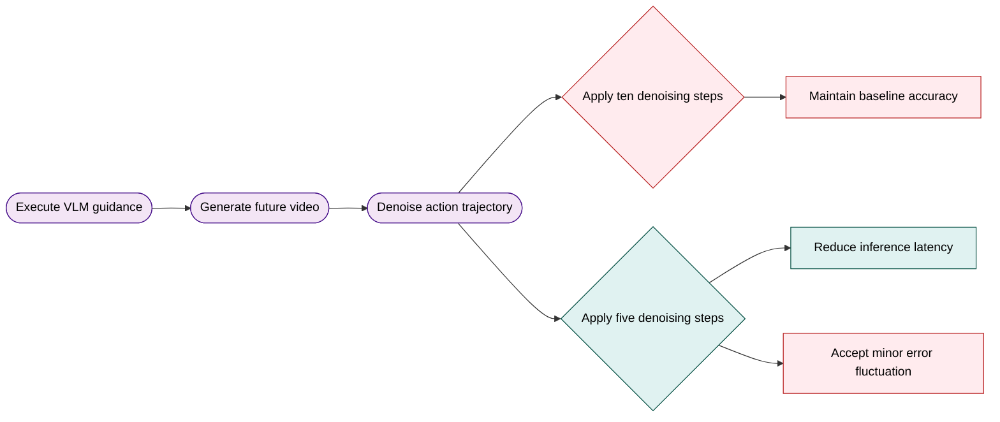
*如何读这张图：* 流程从左至右展示单 chunk 推理的三阶段耗时分解。右侧分支对比了默认配置与低步数变体在精度与延迟上的取舍，直观呈现论文在部署可行性上的工程考量。

综合来看，DriveWAM 的实验设计覆盖了“性能上限验证→核心机制归因→部署效率优化”的完整闭环。论文在报告中明确区分了各模块的独立贡献，并坦诚指出了单视角输入与特定硬件依赖的局限。尽管部分消融未提供统计显著性检验，但其系统性的对照设置与清晰的指标映射，已为“视频生成模型能否直接作为自动驾驶策略骨干”这一命题提供了扎实的实证支撑。

### 实验数据表(原始数值,引自论文)

#### KV memory 策略消融
- **Source**: Table 5
- **Caption**: "KV memory strategies 消融。ADE/FDE 在 20s clips 上测量，KV memory 和 GFLOPs 在 300s clip 下 profile。"

| KV memory | ADE@4s↓ | FDE@4s↓ | Mem.(GB)↓ | GFLOPs↓ |
| --- | --- | --- | --- | --- |
| Full | 0.83 | 2.47 | 3.07 | 17.37 |
| FIFO | 1.40 | 3.47 | 0.25 | 1.05 |
| Selective | 0.89 | 2.52 | 0.25 | 1.44 |

#### NAVSIM v1 比较
- **Source**: Table 1
- **Caption**: "NAVSIM v1 比较。∗ 表示使用 imitation learning 的结果；† 表示使用来自 [53] 的 multiple trajectory anchors 训练；MV 表示 multi-view cameras，SV 表示 single-view camera，L 表示 LiDAR。"

| Method | Ref | Sensors | NC个 | DAC↑ | TTC↑ | C.↑ | EP个 | PDMS ↑ |
| --- | --- | --- | --- | --- | --- | --- | --- | --- |
| Human | 1 | 1 | 100 | 100 | 100 | 99.9 | 87.5 | 94.8 |
| UniAD [54] | CVPR'23 | MV | 97.8 | 91.9 | 92.9 | 100.0 | 78.8 | 83.4 |
| TransFuser [55] | TPAMI'23 | MV&L | 97.7 | 92.8 | 92.8 | 100.0 | 79.2 | 84.0 |
| PARA-Drive [56] | CVPR'24 | MV | 97.9 | 92.4 | 93.0 | 99.8 | 79.3 | 84.0 |
| LAW [57] | ICLR'25 | SV | 96.4 | 95.4 | 88.7 | 99.9 | 81.7 | 84.6 |
| DiffusionDrive [58] | CVPR'25 | MV&L | 98.2 | 96.2 | 94.7 | 100.0 | 82.2 | 88.1 |
| WoTE [59] | ICCV'25 | MV&L | 98.5 | 96.8 | 94.4 | 99.9 | 81.9 | 88.3 |
| VLA-based Methods |  |  |  |  |  |  |  |  |
| ReCogDrive* [4] | ICLR'26 | MV | 98.1 | 94.7 | 94.2 | 100.0 | 80.9 | 86.5 |
| DriveVLA-W0 [3] | ICLR'26 | SV | 98.7 | 96.2 | 95.5 | 100.0 | 82.2 | 88.4 |
| AutoVLA [37] | NeurIPS'25 | MV | 98.4 | 95.6 | 98.0 | 99.9 | 81.9 | 89.1 |
| DriveDreamer-Policy [14] | arXiv'26 | MV | 98.4 | 97.1 | 95.1 | 100.0 | 83.5 | 89.2 |
| DriveVLA-W0t [3] | ICLR'26 | SV | 98.7 | 99.1 | 95.3 | 99.3 | 83.3 | 90.2 |
| WA-based Methods |  |  |  |  |  |  |  |  |
| Epona [24] | ICCV'25 | Sv | 97.9 | 95.1 | 93.8 | 99.9 | 80.4 | 86.2 |
| WorldDrive [22] | arXiv'26 | SV | 98.4 | 95.8 | 95.2 | 99.8 | 83.3 | 89.0 |
| DriveWAM | 一 | sv | 98.3 | 98.1 | 95.2 | 100.0 | 84.3 | 90.1 |

#### PhysicalAI-Autonomous-Vehicles 主结果
- **Source**: Table 2
- **Caption**: "在 PhysicalAI-Autonomous-Vehicles benchmark 的 curated 1,000-clip test subset 上比较。# Params 表示模型参数数量；SV 表示 single-view camera；∗ 表示使用 released checkpoint 评测，且只支持 up to 3s prediction。"

| Method | Source | Sensors | #Params |  ADE@3s↓ | FDE@3s ↓ | ADE@4s↓ | FDE@4s↓ |
| --- | --- | --- | --- | --- | --- | --- | --- |
| VaVAM* [23] | Valeo | sv | 1.3B | 2.31 | 4.32 | 1 | 1 |
| Alpamayo-1.5 [28] | NVIDIA | SV | 10B | 0.80 | 2.31 | 1.44 | 4.18 |
| DriveWAM | 1 | sv | 5B+8B | 0.47 | 1.35 | 0.83 | 2.47 |

#### per-chunk 推理成本与轨迹精度
- **Source**: Table 6
- **Caption**: "在 single H20 GPU 上的 per-chunk inference cost 和 trajectory prediction accuracy。∗ 表示 action denoising steps 从 10 reduced to 5。"

| Method | VLM (ms) | Video Gen (ms) | Action (ms) | ADE@4s↓ | FDE@4s↓ |
| --- | --- | --- | --- | --- | --- |
| Alpamayo-1.5 | 570 |  | 330 | 1.44 | 4.18 |
| DriveWAM (Ours) | 125 | 372 | 765 | 0.83 | 2.47 |
| DriveWAM*(Ours) | 125 | 372 | 374 | 0.84 | 2.45 |

#### scene-evolving guidance 与数据规模消融
- **Source**: Table 3
- **Caption**: "在 PhysicalAI-Autonomous-Vehicles benchmark 上，不同训练数据规模下 scene-evolving driving guidance 的消融。表示 fixed global prompt as text conditioning。"

| # Clips | #Iters | SE Guidance | ADE@4s ↓ | FDE@4s↓ |
| --- | --- | --- | --- | --- |
| 4k | 50k |  | 1.21 | 3.65 |
| 4k | 50k | × | 1.01 | 2.95 |
| 20k | 50k | × | 0.95 | 2.94 |
| 20k | 50k |  | 0.94 | 2.65 |
| 100k | 50k |  | 0.92 | 2.75 |
| 100k | 50k | X | 0.83 | 2.47 |

#### 视频骨干初始化与联合视频监督消融
- **Source**: Table 4
- **Caption**: "视频骨干初始化和 joint video supervision 的消融；所有模型在 100k clips 上训练 50k iterations。"

| Pretrained init. | Video sup. | ADE@4s↓ | FDE@4s↓ |
| --- | --- | --- | --- |
|  | 一 | 1.10 | 3.26 |
| x<> | x | 1.23 | 3.79 |
|  |  | 0.83 | 2.47 |

**效果示例(论文原图):**

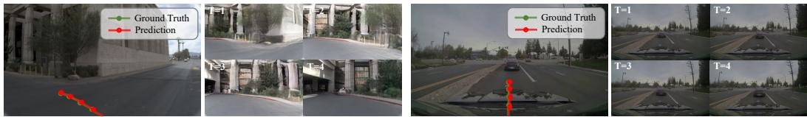

*该图直观呈现了模型在NAVSIM与PhysicalAI-Autonomous-Vehicles基准上的定性效果。生成的未来驾驶场景与自车预测轨迹高度协同，证明DriveWAM实现了路况推演与路线规划的深度融合。*

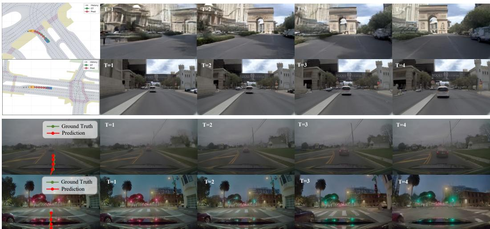

*该图按时间步展示了模型在复杂路况下的动态推演过程。随着未来帧逐步生成，自车轨迹能实时贴合行人、红绿灯等环境变化，充分体现了联合生成策略在长时序决策中的连贯性。*

## 相关工作与定位

**结论前置：** DriveWAM 在自动驾驶策略谱系中的核心定位是“范式翻转”——它不再将世界模型视为辅助规划的特征提取器或独立分支，而是**直接将预训练视频生成模型改造为端到端的视频-动作统一策略骨干**。这一设计跳出了“VLM 主导策略 + 世界模型打补丁”的传统路径，通过共享 Transformer 与统一流匹配目标，将未来场景演化与自车控制动作建模为同一个生成问题，从而在架构层面实现了生成先验与策略决策的深度融合。

回顾近年自动驾驶策略的演进，现有方法大致沿三条路径探索，而 DriveWAM 逐一给出了结构性的替代方案：
1. **VLM 主导的辅助式世界模型（如 DriveVLA-W0、DriveDreamer-Policy）**：这类方法保留了视觉语言模型作为策略核心，仅将生成式世界模型作为高层语义推理的补充。DriveWAM 的突破在于彻底反转主次关系：视频生成先验不再是外挂插件，而是直接接管策略决策的底层计算。
2. **表征迁移与分离式规划器（如 WorldDrive）**：此类工作将驾驶世界模型学到的表征迁移至下游独立规划器，本质上仍是串行流水线。DriveWAM 则摒弃了分离式规划器，将预训练视频 Diffusion Transformer 直接重塑为统一的策略骨干，实现从场景生成到动作输出的端到端映射。
3. **自回归离散 Token 与双塔架构（如 VaViM/VaVAM、Epona）**：前者依赖离散 VQ-VAE Token 与 GPT 式 Transformer 扩展动作专家，后者采用时空 Transformer 配合孪生 Diffusion Transformer 分别处理下一帧生成与自车轨迹预测。DriveWAM 避开了离散分词器的信息瓶颈与定制生成架构的冗余，转而采用连续潜空间下的共享 Transformer，并用统一的流匹配目标联合监督视频潜变量与动作块。

为了直观呈现这一谱系跃迁，下图梳理了从“辅助模块”到“统一骨干”的架构决策路径：
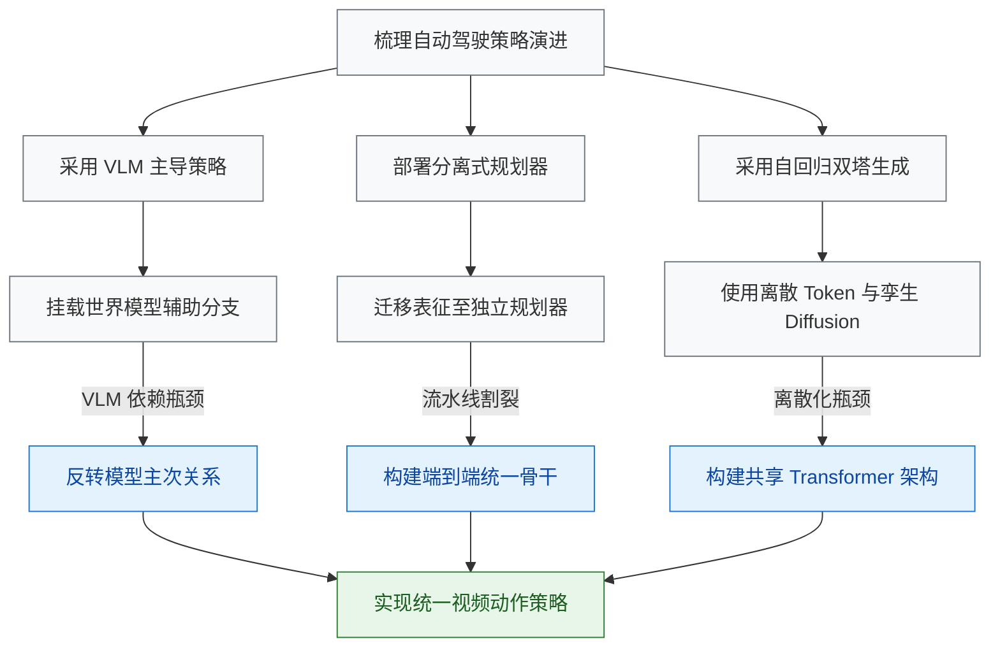
*如何读这张图：* 左侧灰色节点代表传统范式及其固有瓶颈；蓝色节点为 DriveWAM 针对各痛点做出的架构翻转决策；最终汇聚于绿色核心节点，即“共享 Transformer + 统一流匹配”的端到端策略骨干。全图采用矩形保持形状一致，箭头方向自上而下展示技术代际的单向演进。

下表从策略核心、世界模型角色与生成范式三个维度，横向对比了 DriveWAM 与代表性基线的设计差异：

| 方法谱系 | 策略核心骨干 | 世界模型角色 | 生成优化范式 |
|---|---|---|---|
| VLA 辅助式方法 | VLM 主导 | 辅助分支 | VLA 联合微调 |
| 表征迁移方法 | 独立规划器 | 表征提取 | 串行流水线 |
| 自回归生成方法 | GPT 式架构 | 自回归预测 | 离散 Token 优化 |
| DriveWAM | 视频 Diffusion | 统一策略骨干 | 共享流匹配目标 |

<strong>继承关系、消融设计与工程基座（展开查看）</strong>

DriveWAM 并非从零构建，其工程实现与推理优化深度继承了现有开源生态，并在关键环节做了针对性改造：
- **代码与权重基座**：系统直接基于 `Causal World Modeling for Robot Control [19]` 的代码框架与已发布基础检查点初始化，将原机器人控制场景的噪声历史增强与 Euler ODE 求解器设置平移至自动驾驶域，大幅降低了训练冷启动成本。
- **长程推理缓存优化**：针对自回归视频生成的 KV Cache 膨胀问题，DriveWAM 吸收了 `FlowCache [26]` 的相关性冗余度筛选准则，并将其改造为模态感知的视频与动作 KV 内存池。该设计在消融实验中与 FIFO 缓存、全量缓存进行了对比，验证了其在长程 rollout 中维持推理效率与策略稳定性的有效性。
- **高层语义引导分工**：为避免 VLM 喧宾夺主，DriveWAM 冻结 `Qwen3-VL-8B [9]` 仅用于生成块级语义意图，作为场景演化引导信号。消融实验明确剥离了该引导模块，以验证视频生成先验本身是否足以支撑策略决策，从而支撑了分工而非融合的设计主张。

*严谨性提示：* 论文在对比中明确区分了“声称”与“证明”的边界。例如，将世界模型作为策略骨干的宣称，已通过消融实验验证了视频生成先验的独立有效性；但在跨域泛化与极端长尾场景下的误差范围，论文未提供完整的置信区间报告。读者在解读“首个统一视频动作骨干”等表述时，需注意其基准测试仍集中于 NAVSIM 与 PhysicalAI-Autonomous-Vehicles 等标准数据集，外推至开放道路需结合传感器噪声分布偏移等替代解释谨慎评估。

## 研究探索历程

将预训练视频扩散模型直接改造为自动驾驶策略核心是一条可行且具扩展性的路径，但其成功高度依赖“世界-动作联合建模”“动态语义引导注入”与“选择性KV记忆”三大机制的协同；单纯的动作适配、静态文本条件或基于时间新旧的缓存淘汰，均会在长时程推演中迅速失效。

为清晰还原该研究的真实迭代轨迹，下图将核心问题、关键决策、死胡同与方向转变映射为探索流：
```mermaid
flowchart TB
  classDef question fill:#e8f0fe,color:#1a73e8,stroke:#1a73e8,stroke-width:2px;
  classDef decision fill:#e6f4ea,color:#137333,stroke:#137333,stroke-width:2px;
  classDef deadend fill:#fce8e6,color:#c5221f,stroke:#c5221f,stroke-width:2px;
  classDef pivot fill:#fef7e0,color:#b06000,stroke:#b06000,stroke-width:2px;
  
  subgraph 架构与表征探索
    q1(能否改造视频生成骨干):::question -->|核心问题| d1{选择世界动作联合策略}:::decision
    d1 -->|架构决策| d2{统一视频动作时序序列}:::decision
    d2 -->|表征设计| d3{采用逆动力学动作生成}:::decision
    d3 -->|生成范式| e1["验证联合视频监督"]:::deadend
    e1 -.负向验证.-> x3["仅动作监督破坏先验"]:::deadend
  end

  subgraph 语义与长时记忆优化
    q3(如何补足高层驾驶语义):::question -->|语义痛点| p1(从全局提示转向分块引导):::pivot
    p1 -->|路线转向| d4{引入场景演化驾驶引导}:::decision
    d4 -->|引导生成| d5{时序局部化引导注入}:::decision
    d5 -->|注入机制| e2["消融验证引导收益"]:::deadend
    
    q4(如何控制长时KV缓存):::question -->|缓存瓶颈| x1["FIFO缓存误删关键线索"]:::deadend
    x1 -->|淘汰失效| d6{采用模态感知选择性记忆}:::decision
    d6 -->|记忆设计| e3["对比全量与FIFO缓存"]:::deadend
  end

  subgraph 扩展性与工程落地
    q5(策略是否随数据扩展):::question -->|扩展验证| e4["验证四千至十万级扩展"]:::deadend
    e4 -->|规模收益| p2(转向可扩展基座验证):::pivot
    q6(如何构建评测子集):::question -->|评测构建| x2["随机抽样稀释长尾场景"]:::deadend
    x2 -->|抽样偏差| d7{基于兴趣分数筛选}:::decision
    q7(推理成本能否逼近基线):::question -->|成本优化| d8{单块查询复用引导}:::decision
    d8 -->|推理加速| e5["降低动作去噪步数"]:::deadend
  end
```
**如何读这张图**：圆角节点代表驱动研究的核心问题与路线转向，菱形节点为最终采纳的技术判定，矩形节点标记被实验证伪的假设或验证环节。箭头方向即实际研发顺序，虚线表示“若走此路将导致性能退化”的负向验证。

**架构选型：从生成先验到策略核心的跨越**
研究起点直指一个核心痛点：传统VLM-centric策略缺乏对稠密时序动态的建模能力。团队放弃将未来视频生成作为辅助分支或独立规划器的保守路线，直接选择pretrained video generative model作为policy core。关键机制在于将驾驶clip切分为连续chunks，利用pretrained VAE编码视频chunk，配合MLP action encoder编码ego-action chunk，按时间顺序拼接为统一token序列。在动作生成路径上，采用inverse-dynamics范式：先由骨干生成future video latent，再让action branch在该潜在表征与当前上下文的联合条件下回归action velocity。
这一设计并非直觉上的“即插即用”。消融实验明确显示，若剥离video supervision仅做动作适配，轨迹误差会显著恶化。这证明action-only adaptation无法保留WA policy learning所需的generative video priors，联合video-action flow-matching才是维持策略有效性的基石。

**语义注入：从静态提示到动态演化的转向**
视频骨干虽能捕捉物理动态，却天然缺失高层驾驶语义（如route intent、traffic participants交互）。初期尝试使用固定global prompt作为text conditioning，但很快暴露出局限性：静态条件无法随scene context演化，难以表达当前horizon的驾驶意图。团队由此发生关键pivot，转向scene-evolving driving guidance。具体实现为在每个decision step调用frozen Qwen3-VL-8B，基于latest observation、recent ego trajectory与route command生成chunk-specific的$g_k$，并通过block-diagonal text mask实现temporally localized injection，确保目标chunk仅聚焦对应引导tokens。
消融结果证实，该机制在不同数据规模下均能稳定改善轨迹预测趋势，且收益未随训练数据增加而消失，说明动态语义注入是独立于数据量的有效增益源。

**长时推演：缓存淘汰机制的试错与重构**
自回归rollout必然面临KV cache随长度线性膨胀的瓶颈。团队最初假设仅保留最近tokens（FIFO sliding-window）即可近似完整历史，但实验将其判定为死胡同：基于时间新旧的淘汰机制会误删旧但decision-relevant的车辆运动趋势或被遮挡行人线索，同时保留大量冗余静态背景。
为此，研究重构为modality-aware selective KV memory。系统维护video与action两个bounded memory pools，摒弃单纯的时间戳排序，转而计算relevance-redundancy score以淘汰低分token。在固定缓存预算下，该方案大幅逼近Full KV caching的轨迹表现，且显著优于FIFO，证明长horizon驾驶缓存必须同时权衡当前相关性与历史冗余度。

**扩展验证与工程权衡**
为验证该范式的scalability，团队在PhysicalAI-Autonomous-Vehicles上将训练规模从4k逐步扩展至100k clips。ADE@4s与FDE@4s呈现持续改善趋势，未见饱和拐点，促使研究重心从单组件有效性验证正式转向scalable foundation验证。评测集构建同样经历路线修正：放弃随机抽样（易被ordinary driving scenarios主导并稀释rare-event覆盖），改用Qwen3-VL-8B进行scene tagging与interest score筛选，保留高interest clips以兼顾long-tail与常规控制场景。
推理侧，通过每chunk仅查询一次VLM并跨denoising steps复用guidance，以及降低action denoising steps，per-chunk总耗时被压缩至接近Alpamayo-1.5的水平，轨迹指标仅发生微幅波动，验证了该架构在工程部署上的可行性。

<strong>关键消融配置与负结果细节（展开）</strong>

- <strong>Video Supervision 剥离实验</strong>：移除联合视频监督后，模型退化为纯动作回归器，轨迹误差显著上升。论文指出这是因为生成先验在策略微调阶段被破坏，无法提供未来状态分布的稠密约束。
- <strong>FIFO vs Selective KV 对比</strong>：在相同缓存预算下，FIFO方案因丢弃早期关键交互证据导致长时程规划发散；Selective方案通过模态分离池与相关性打分，在保留历史决策锚点的同时剔除冗余背景，轨迹误差逼近Full Cache基线。
- <strong>Guidance 消融</strong>：移除scene-evolving guidance或退化为全局固定prompt，模型在复杂路口与多车交互场景下的轨迹一致性下降，证明动态语义注入对高层意图对齐具有不可替代性。
- <strong>数据规模扩展</strong>：从4k到20k再到100k clips，ADE@4s与FDE@4s单调下降，表明当前策略容量尚未触及数据瓶颈，具备继续Scaling的潜力。

整条探索路径表明，将视频生成先验转化为驾驶策略并非简单的架构替换，而是一场针对时序动态、语义对齐与计算效率的系统性重构。每一步死胡同的排除与方向修正，均指向同一个结论：只有让生成模型“看懂”动态世界、“听懂”演化意图，并“记住”关键历史，才能真正胜任长时程自动驾驶决策。

## 工程与复现要点

复现 DriveWAM 的工程核心在于“全量微调 5B 视频生成骨干 + 因果时序语义引导 + 选择性 KV 记忆池”，训练强依赖 48 卡 H20 集群与特定的流匹配积分区间；目前仅开放模型权重，官方训练代码尚未公开，复现需自行搭建基于 [19] 框架的适配管线。

### 模型规模与核心结构
**结论：** 架构以 `Wan2.2-TI2V-5B` 为策略核心，通过统一时序 Token 序列联合建模视频与动作，并引入冻结的 `Qwen3-VL-8B` 提供因果语义引导，以解决传统策略模型缺乏长程时空先验与语义对齐的痛点。

论文并未从零构建策略网络，而是直接复用大规模视频生成模型的隐式物理先验。输入视频经预训练 VAE 压缩为 $z_k$，动作增量经隐藏维度 3072 的 MLP 投影，两者拼接为统一时序序列送入 DiT。为注入车辆动力学上下文，系统增设独立的 ego-state 交叉注意力分支（处理速度、加速度、曲率）。语义引导方面，采用块对角文本掩码的时序局部交叉注意力，确保每个预测 Chunk 仅访问当前因果可用的 $g_k$，彻底切断未来信息泄漏。长程 Rollout 的显存瓶颈由 Selective KV Memory 缓解：通过 $\lambda = 0.07$ 权衡相关性与冗余度，将 Video/Action 缓存硬限制在 448/160 Token，在显著降低开销的同时逼近全量缓存性能。

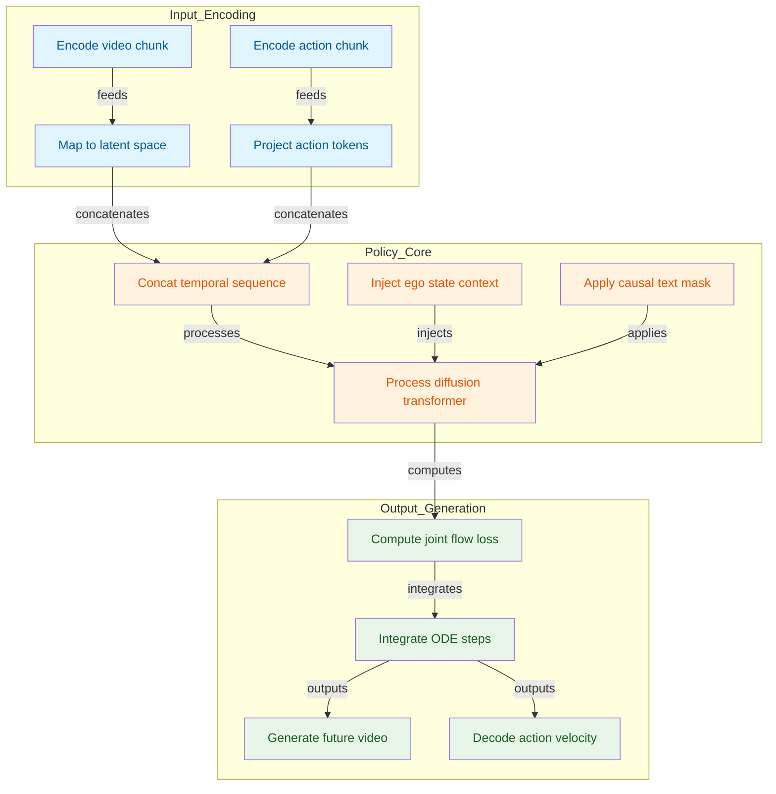
*如何读这张图：* 左侧为异构输入编码，中部为联合策略核心（含状态与语义注入），右侧为流匹配积分与双分支输出。箭头方向即数据流向，块对角掩码与独立注意力分支是保证因果一致性的关键门控。

### 训练关键超参与作用
**结论：** 训练采用低学习率全量微调与阶梯衰减策略，通过 4 秒 Chunk 与 1Hz/10Hz 异构采样率平衡显存占用与控制平滑性，联合流匹配目标由 $\beta_a = 1.0$ 严格对齐。

全量微调视频骨干能最大程度保留大规模时空先验（消融实验证实从头训练会丢失先验并导致性能下滑）。视频流降采样至 1Hz 用于场景演化建模，而 Ego 动作保持 10Hz 以保障轨迹生成的控制粒度。训练分辨率锁定 256×448，直接适配视频生成骨干的输入窗口与驾驶视频比例。

| 参数 | 取值 | 核心作用 |
|:---|---:|:---|
| 分辨率 | 256×448 | 适配骨干与输入 |
| 优化器 | AdamW | 稳定扩散微调 |
| 动量 | 0.9/0.95 | 抑制梯度震荡 |
| 权重衰减 | 0.1 | 控制过拟合风险 |
| 基础学习率 | 1e-5 | 设定微调步长 |
| 衰减节点 | 50k/70k/90k | 阶梯式收敛控制 |
| 批次大小 | 1 | 规避显存溢出 |
| 动作权重 | 1.0 | 平衡联合目标 |

<strong>训练调度与数据裁剪细节</strong>

NAVSIM 设置训练 100k 迭代，学习率在 50k、70k、90k 处按 0.5 因子阶梯衰减；PhysicalAI 主实验固定 50k 迭代。数据层面，从 20 秒长 Clip 中随机裁剪 12 秒片段，保持样本长度一致并覆盖长时依赖。Guidance 在训练阶段预计算并缓存，严格对齐当前预测 Horizon，避免未来语义泄漏。

### 推理部署与运行环境
**结论：** 推理依赖非对称 ODE 积分步数与预计算引导缓存，单卡 H20 即可评估单 Chunk 延迟，但完整训练需 48 卡集群与 vLLM 编译加速。

推理阶段采用 Euler ODE 求解器，但视频与动作分支的积分区间与步数非对称：视频 Token 仅从 $\tau = 1$ 积分至 $\tau = 0.6$（3 步），生成中间噪声水平的未来 Latent 即可作为动作分支的条件；动作 Token 则从 $\tau = 1$ 积分至 $\tau = 0$（10 步），直达干净端点以输出精确速度。Appendix C 指出，将动作步数降至 5 步可显著降低延迟且轨迹指标变化极小，为实时部署提供弹性。Guidance 在推理时每个决策步仅计算一次，并在所有去噪步中复用，避免重复调用大语言模型。

<strong>硬件依赖与框架说明</strong>

训练环境：48 NVIDIA H20 GPUs。推理成本分析基于单张 NVIDIA H20 GPU。代码框架基于 [19] 的开源实现，关键依赖包括 AdamW、Wan2.2-TI2V-5B、Qwen3-VL-8B、预训练 VAE、FlowCache 机制、Euler ODE 求解器及 vLLM 编译优化。Python 版本与具体随机种子论文未报告，复现时需自行对齐依赖版本。

### 开源状态与复现入口
**结论：** 项目仅开放 Hugging Face 模型权重，未公开训练/推理代码，复现需逆向工程或基于社区框架重构管线。

经检索论文正文、Papers-with-Code 索引及 Hugging Face，未发现官方公开仓库。当前唯一可获取的入口为模型权重：`https://huggingface.co/chenchenshi/DriveWAM`。复现工程师需自行实现 VAE 编码、统一 Token 拼接、块对角掩码交叉注意力、Selective KV 缓存逻辑及非对称流匹配积分。建议优先对齐 [19] 的基础代码框架，并严格遵循 Sec 3 与 Sec 4 的模块接口定义；由于论文未报告随机种子与完整 Python 依赖树，复现结果可能存在微小方差，需通过消融实验验证核心组件（如预训练初始化、联合视频监督、因果掩码）的有效性。

## 局限与适用边界

该方案的性能高度依赖预训练视频先验与严格的因果上下文约束，在跨域泛化、长时记忆保留与闭环实车部署中仍存在明确的失效边界。以下逐条拆解其假设前提、已知风险与适用条件。

**结论：生成式动作的质量被视频基础模型的领域先验“锁死”。** 论文依赖 pretrained video foundation model 作为核心生成引擎，其能力本质上来自视频生成先验。直觉上（非严格对应），这类似于让模型“脑补”未来画面再据此决策。若预训练先验与 driving domain 的分布不匹配（如罕见天气、非常规交通参与者），模型生成的未来轨迹将偏离真实物理规律，直接导致 action generation 受限。论文目前仅报告了特定数据集上的正向结果，尚未提供跨域微调或领域自适应的消融实验，因此该先验在分布外场景下的有效性仍属“声称”而非“证明”。

**结论：视频模型缺乏高层语义规划能力，必须外挂 frozen VLM guidance，且该引导对输入条件极度敏感。** 视频生成先验擅长像素级补全，但不具备 route command 解析与长程决策能力。架构因此强制引入 frozen VLM guidance 注入语义信号。然而，引导质量直接受 latest observation、recent ego trajectory、route command 与 prompt 的联合影响。若任一输入存在噪声或歧义，VLM 输出的语义信号将发生漂移，进而污染后续的 latent 生成。论文未报告针对 prompt 鲁棒性或 VLM 幻觉的负结果分析，也未给出误差范围。

**结论：推理期“先生成 latent 再生成 action”的串行设计引入了 train-test mismatch，仅靠启发式增强缓解。** 训练时模型可能接触真实历史分布，但推理期 action 分支完全依赖 generated latent。这种自回归依赖会放大累积误差。论文采用 noisy-history augmentation 试图缩小 gap，但未给出更细公式或量化该缓解策略的实际边界。

**结论：Selective KV memory 以牺牲部分历史完整性换取推理效率，存在“关键证据被提前驱逐”的风险。** 作为 inference-time、training-free 的 full-history attention 近似，它通过 cache selection 降低长时 rollout 成本。但缓存淘汰策略是启发式的，若某段历史在早期看似冗余，却在后续决策中成为关键线索，该机制可能将其错误驱逐。

**结论：Scene-evolving guidance 必须严格遵循因果时序，任何未来信息泄露都会直接破坏系统一致性。** 实现中若误用 target chunk observation 或 later guidance，将导致模型“偷看”答案。这是生成式规划架构的通用红线，论文虽强调因果可用上下文，但未在消融中量化信息泄露对最终指标的破坏程度。

**结论：现有实验结论仅对特定 curated 子集成立，尚未覆盖真实部署的复杂变量。** 论文主要报告 NAVSIM 与 PhysicalAI-Autonomous-Vehicles 上的结果。需注意，PhysicalAI-Autonomous-Vehicles 子集经过 VLM tagging 与 rule-based interest score 过滤，评估分布受构造策略影响。该方案未证明在所有 sensor layouts、route annotation regimes 或闭环真实部署中同样成立。

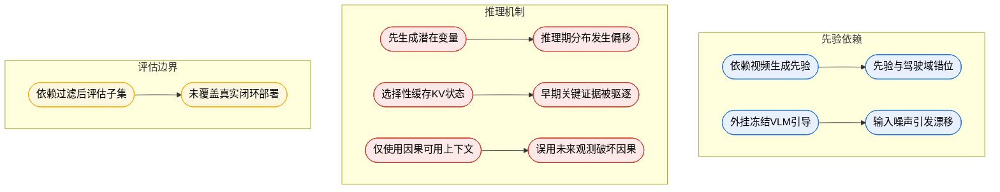
**如何读这张图：** 该流程图按“先验依赖→推理机制→评估边界”三阶段展开，左侧圆角节点为架构设计约束，右侧圆角节点为对应的已知失效模式。箭头表示因果传导路径，颜色区分风险来源层级。若你的业务场景涉及非标准传感器布局或强因果隔离要求，需重点核对右侧对应节点的缓解策略是否已覆盖。

<strong>技术细节与边界 Caveat</strong>

- **noisy-history augmentation 的数学空白：** 论文仅提及使用该策略缓解 train-test mismatch，但未公开扰动分布的具体参数（如噪声方差、时间衰减系数或注入比例）。复现时需自行设计历史帧的退化策略，否则可能无法复现原文的误差收敛曲线。
- **KV 缓存驱逐的不可逆性：** Selective KV memory 的 cache selection 是单向淘汰过程。一旦早期关键证据（如远处缓慢切入的车辆）被判定为低优先级并移出缓存，后续 attention 将无法召回该信息。该机制在长时程（>10s）复杂路口场景中可能引发决策断层。
- **因果泄露的隐蔽性：** Scene-evolving guidance 的实现若未严格对齐时间戳，极易在数据加载或特征对齐阶段混入 target chunk observation。此类泄露在开环评估中可能表现为指标虚高，但在闭环 rollout 中会迅速暴露为控制震荡。建议在部署前增加时间戳对齐校验与因果掩码单元测试。
- **评估分布的构造偏差：** PhysicalAI-Autonomous-Vehicles 的 VLM tagging 与 rule-based interest score 过滤本质上是一种“高价值场景采样”。该子集可能过度代表结构化道路或典型交互，对长尾分布（如无标线乡村道路、密集非机动车混行）的覆盖不足。若你的目标场景偏离该分布，需重新评估 baseline 的适用性。

## 趋势定位与展望

**结论：** DriveWAM 标志着端到端自动驾驶策略正从“VLM 语义主导”转向“视频生成先验驱动”，其核心价值在于用统一的连续时空生成骨干替代了割裂的感知-规划模块，并通过因果语义注入与选择性记忆机制，初步打通了长时域自回归决策的工程路径。

过往的主流路线（如 DriveVLA-W0、DriveDreamer-Policy）高度依赖 VLM 作为策略核心，但 VLM 的预训练数据以静态图文对为主，天然缺乏对物体持续性、运动连续性与场景演化的建模能力。DriveWAM 的破局点在于“角色互换”：将 pretrained video diffusion transformer 直接提拔为 policy backbone，让模型先“想象”出物理上可行的未来世界，再通过 inverse-dynamics readout 从中解码出 ego action。相较于 VaViM/VaVAM 依赖离散 VQ-VAE token 与 GPT 式架构，或 Epona 采用双扩散塔分别处理帧生成与轨迹预测，DriveWAM 通过 unified temporal token sequence 与 joint flow-matching objective，将视频潜变量与动作 chunk 置于同一优化流中，避免了离散量化带来的信息瓶颈与多分支架构的协同损耗。

为直观呈现该路线的演进逻辑与架构权衡，下图梳理了从“语义外挂”到“统一生成”的范式迁移：
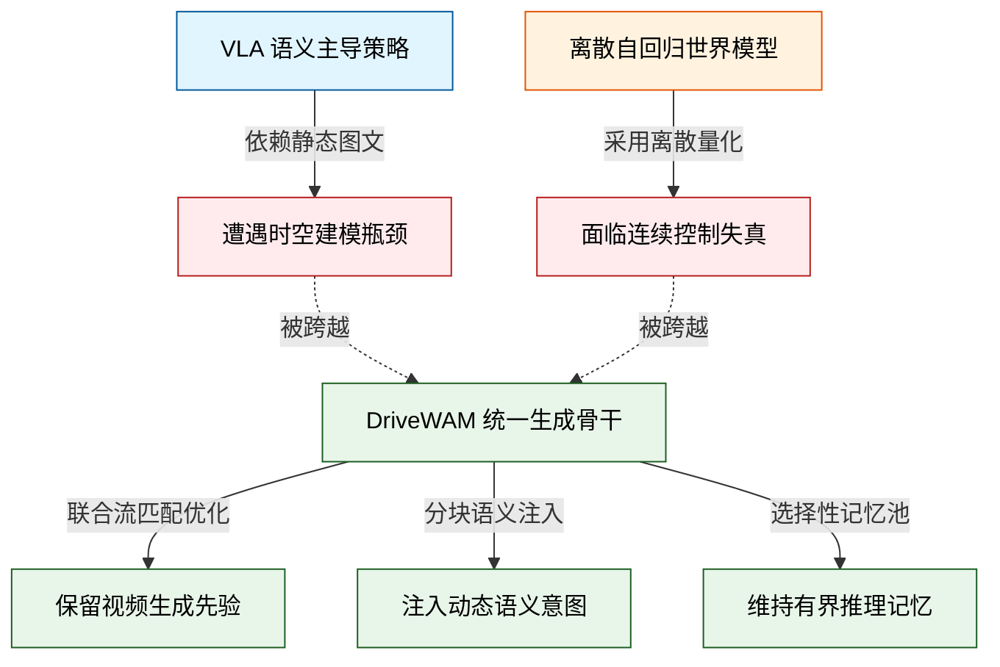
*如何读图：* 左侧两条路径代表过往尝试及其固有瓶颈（红色），DriveWAM（绿色）通过统一连续生成骨干与解耦的语义/记忆模块，直接跨越了结构断层，将生成先验转化为可执行策略。

这一设计并非简单拼接，而是针对自动驾驶决策痛点的精准拆解。高层意图由 frozen Qwen3-VL-8B 以 chunk-specific 形式生成，并通过 temporally localized cross-attention 注入，确保语义条件随交通参与者与路线动态演化，而非依赖僵化的全局 prompt。长时域 rollout 的上下文爆炸问题，则通过 selective KV memory 缓解：模型在推理期维护分离的 video 与 action memory pools，依据 relevance-redundancy 准则保留关键历史 token，既规避了 full cache 的线性增长，又修正了 FIFO 盲目丢弃旧证据的缺陷。在 NAVSIM v1 上，该架构以 13B 参数量取得 PDMS 90.1 的成绩，并在 PhysicalAI-Autonomous-Vehicles 子集上优于 VaVAM 与 Alpamayo-1.5，验证了视频生成先验向控制策略迁移的有效性。

尽管路径清晰，该路线仍面临若干待验证的边界条件。首先，选择性 KV memory 仅在推理期应用，未改变训练目标，其 relevance-redundancy 代理信号在极端分布偏移下的鲁棒性仍需大规模负结果测试支撑。其次，当前 guidance 依赖 frozen VLM，属于“开环语义注入”，若 VLM 产生幻觉或误判，策略骨干缺乏在线纠错机制；未来或需探索将语义意图与视频生成先验进行联合微调，而非仅靠 cross-attention 拼接。此外，论文目前仅报告单前视相机输入下的表现，多模态传感器的时序对齐与联合流匹配尚未展开。随着数据规模扩大，视频动作策略的 scaling law 是否遵循传统 LLM 的幂律，以及 13B 参数量在车载边缘算力上的实时性优化，将是决定该技术能否从仿真走向量产的关键分水岭。

<strong>延伸技术边界与消融提示</strong>

- <strong>消融与负结果：</strong> 论文通过消融验证了 chunk-specific guidance 相比固定全局 prompt 在不同数据规模下的轨迹预测增益，但未公开 full cache 与 FIFO 在极端长序列下的具体失败率分布。
- <strong>相关性≠因果：</strong> PDMS 90.1 的提升可能部分源于 flow-matching 对连续动作空间的天然平滑性，而非纯粹的视频先验迁移；需控制变量对比同等架构下不同预训练目标的贡献。
- <strong>计算开销：</strong> 13B 参数联合流匹配推理涉及多步 ODE 求解（基于 Euler solver），实际车载部署需依赖蒸馏或步数压缩，当前报告未给出端到端延迟数据。

